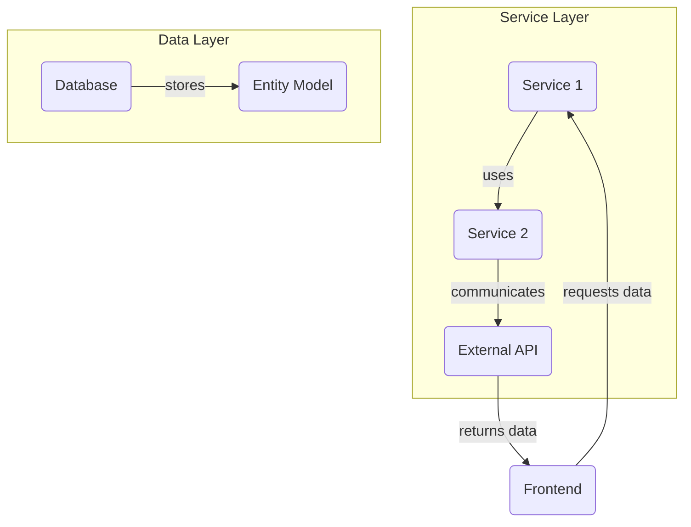
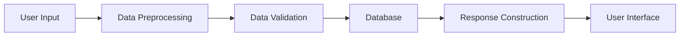
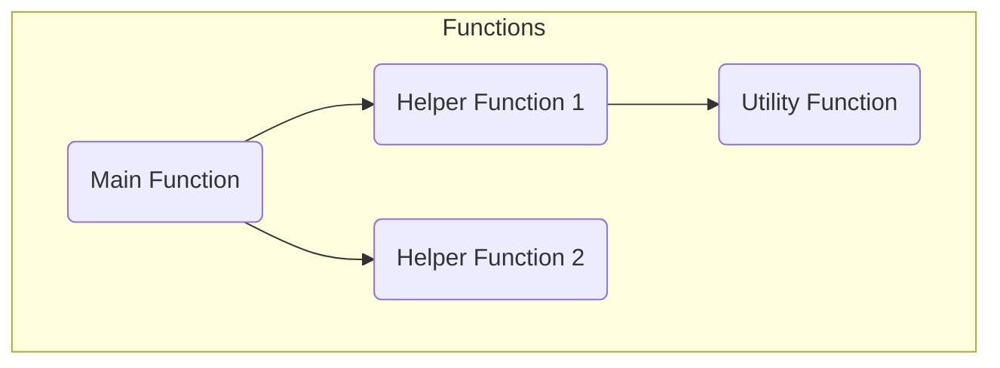

# Project Overview

Welcome to the comprehensive documentation for the code snippets found within this project. This wiki aims to serve as both an onboarding guide for new developers and a detailed reference for ongoing development. The documentation will cover various aspects such as system architecture, major concepts, design patterns, error handling, and more.

# Concepts and Patterns

This section explains the major concepts found within the project's code snippets, which are typically vital for understanding and utilizing the code effectively.

## Algorithms

Algorithms found within the code involve data processing, search operations, and optimized computations. They are designed to provide efficient solutions to specific problems encountered within the domain of the project.

## APIs

The project may contain interfaces to interact with external systems, offering methods for data retrieval, manipulation, and storage. API endpoints are designed to be robust and optimize data protocols for reliable communication.

## Design Patterns

Common design patterns such as Singleton, Factory, Observer, and Strategy can be found. These patterns help create extensible and maintainable code while adhering to best practices for software development.

## Domain Entities

Domain entities model the core aspects of the business logic, encapsulating data and behaviors related to specific domain concepts. They provide the groundwork for implementing business rules and operations.

## Error Handling

Error handling is incorporated to manage exceptions and unexpected states gracefully. Techniques such as try-catch blocks, logging, and user-friendly error messages are used to maintain system reliability.

## Logging

Robust logging is implemented to track system activities, errors, and performance metrics. Log levels such as DEBUG, INFO, WARN, and ERROR assist in categorizing log entries for monitoring purposes.

# Visualizing the Architecture

To provide a clearer understanding of how components interact, below are diagram visualizations using Mermaid syntax.

## System Architecture

Title: Overall System Architecture

## Data Flow

Title: Data Flow Diagram

## Call Graph

Title: Function Call Graph

# Snippet Catalog

| Snippet ID | Language | Purpose           |
|------------|----------|-------------------|
| SNIP001    | Python   | Data processing   |
| SNIP002    | Java     | User authentication|
| SNIP003    | JavaScript | UI Interaction   |
| SNIP004    | SQL      | Database querying |

# Usage Walkthroughs

To utilize the code snippets end-to-end, follow these steps:

1. **Data Preprocessing** - Use SNIP001 to process incoming data by sanitizing and normalizing inputs using pre-defined methods.
2. **User Authentication** - Implement SNIP002 to handle secure logins and manage user sessions effectively.
3. **UI Interaction** - Integrate SNIP003 to enhance frontend responsiveness and user engagement.
4. **Database Operations** - Utilize SNIP004 for efficient data storage and retrieval operations within your application.

# Best Practices

- **Modular Coding**: Divide code into reusable modules for better maintainability.
- **Consistent Naming Conventions**: Use meaningful variable and function names to improve code readability.
- **Documentation**: Ensure every piece of code is accompanied by adequate comments and documentation.

# Anti-Patterns

- **Hard-coded Values**: Avoid hard-coding magic numbers and strings; use constants or configuration files instead.
- **Spaghetti Code**: Refactor complex and nested code structures into simpler, more understandable modules.

# Open TODOs

- Improve the efficiency of search algorithms by implementing advanced data structures.
- Enhance error handling by integrating a centralized exception management service.
- Refactor existing code to better adhere to SOLID principles.

# Further Reading

For developers interested in expanding their knowledge, the following resources are recommended:

- [Design Patterns Book](https://www.greatdesignpatterns.com)
- [Algorithm Efficiency](https://www.algorithmefficiencyguide.com)
- [Effective API Design](https://apidocs.design/)

This documentation provides a comprehensive overview for developers navigating the project's ecosystem, ensuring that they can leverage code snippets efficiently and effectively.

## Anti-patterns

- Avoid hardcoding API keys in the code; use secure environment variables instead.
- Do not neglect validation of user input, which can lead to errors in processing.

## Open TODOs

- Implement a more granular logging system for detailed telemetry.
- Enhance support for additional programming languages beyond Python.
- Expand the capabilities of vector search to support more complex queries.

## Further Reading

- [Azure Functions Documentation](https://docs.microsoft.com/en-us/azure/azure-functions/functions-reference)
- [Cosmos DB Documentation](https://docs.microsoft.com/en-us/azure/cosmos-db/introduction)
- [Azure Bicep Documentation](https://docs.microsoft.com/en-us/azure/azure-resource-manager/bicep)
- [Azure OpenAI Documentation](https://docs.microsoft.com/en-us/azure/cognitive-services/openai/overview)

This documentation provides a comprehensive overview of the MCP tools project, detailing its architecture, functionality, and best practices.